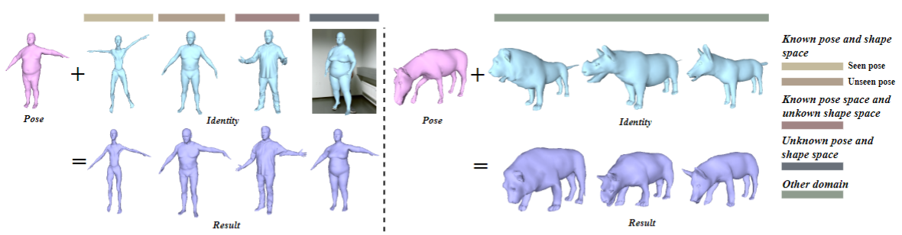

# CGTransformer
Code for our AAAI 2022 paper "[Contrastive-Geometry Transformer network for Generalized 3D Pose Transfer](https://arxiv.org/abs/2112.07374)"
# Contrastive-Geometry Transformer

This is the PyTorch implementation of our AAAI 2022 paper Geometry-Contrastive Transformer for Generalized 3D Pose Transfer.
[Haoyu Chen](https://scholar.google.com/citations?user=QgbraMIAAAAJ&hl=en), [Hao Tang](https://github.com/Ha0Tang), [Zitong Yu](https://scholar.google.com/citations?user=ziHejLwAAAAJ&hl=en), [Nicu Sebe](https://scholar.google.it/citations?user=tNtjSewAAAAJ&hl=en), [Guoying Zhao](https://scholar.google.com/citations?user=hzywrFMAAAAJ&hl=en). <br>



#### Citation

If you use our code or paper, please consider citing:
```
@inproceedings{chen2021GCN,
  title={Geometry-Contrastive Transformer for Generalized 3D Pose Transfer},
  author={Chen, Haoyu and Tang, Hao and Yu, Zitong and Sebe, Nicu and Zhao, Guoying},
  booktitle={AAAI},
  year={2021}
}
```

## Dependencies

Requirements:
- python3.6
- numpy
- pytorch==1.1.0 and above
- [trimesh](https://github.com/mikedh/trimesh)

## Dataset preparation
We use the SMPL-NPT dataset provided by NPT, please download data from this link http://www.sdspeople.fudan.edu.cn/fuyanwei/download/NeuralPoseTransfer/data/, 

## Training
The usage of our code is easy, just run the code below.
```
python train.py
```

# Evaluation

We use the same evaluation protocol as NPT for both seen and unseen settings.

Run the code below to conduct the evaluation.
```
python evaluation_NPT.py
```

## Acknowledgement
Part of our code is based on 

3D transfer: [NPT](https://github.com/jiashunwang/Neural-Pose-Transfer)，

Transformer framework: (https://github.com/lucidrains/vit-pytorch) 

Many thanks!

## License
MIT-2.0 License
